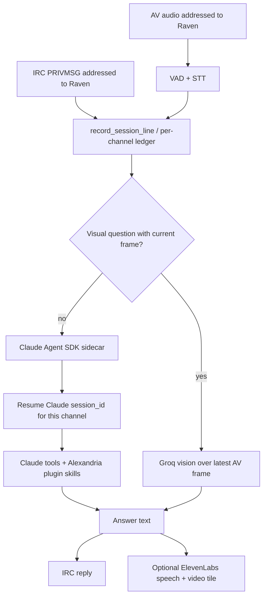

# freeq-raven

`freeq-raven` is Raven's product repo: a heavily customized Freeq chat and AV
agent that joins real Freeq rooms, participates in calls, keeps one room
session context, and answers through a Claude Agent SDK session.

Freeq itself remains the protocol/runtime dependency. Raven-specific behavior
belongs here, not in Freeq examples.

## Repository Boundaries

- `chad/freeq`: upstream Freeq runtime, SDK, AV, bot, and example code. Generic
  fixes should go there directly.
- `sociotechnica-org/freeq-raven`: Raven product behavior, prompts, local
  launch/deployment, and Claude Agent SDK sidecar integration.
- target product repos: the work Raven inspects or edits through Claude tools,
  Alexandria, Fabro, tests, or deployment tools.

This repo depends on Freeq crates from `chad/freeq` by git revision. It does not
vendor or patch `freeq-eliza`.

## Current Shape

```text
freeq-raven/
  Cargo.toml
  crates/
    freeq-raven/          # Rust runtime: chat, AV, STT, TTS, video, routing
  bin/
    freeq-raven           # loads .env and execs target/release/freeq-raven
    freeq-raven-start     # background/tmux launcher
    raven-claude-agent    # Claude Agent SDK sidecar command
  ops/
    systemd/              # Linux service template
```

The old `.deps/freeq` bootstrap path is retired. `make bootstrap` now builds
this standalone Rust workspace.

## Architecture

Raven should be one agent loop, not one chat bot plus one AV bot plus a separate
tool brain. Chat and voice flow through the same runtime process, the same
per-channel context, and the same Claude session.



The Rust runtime owns Freeq adapters, AV frame/audio plumbing, TTS, video, loop
guards, and the lightweight room ledger. The Claude Agent SDK sidecar owns the
LLM session and in-session tool loop. It resumes one Claude `session_id` per
Freeq channel, so chat and AV follow-ups land in the same Claude session.

## LLM Session

The normal local loop is:

- Raven records every chat/voice line in the per-channel ledger.
- If the addressed turn is visual and the asker has a current frame, Raven uses
  the vision path.
- Otherwise Raven sends one turn to `bin/raven-claude-agent`.
- The sidecar calls `@anthropic-ai/claude-agent-sdk` with the channel's prior
  Claude `session_id` when present.
- Claude may answer directly or use its configured tools/skills, including the
  Alexandria Claude plugin when installed in the agent workdir.

There is no separate Mercury decision about whether to hand a turn to Codex.
Tool use is Claude's own agent loop inside the resumed Claude session.

## Freeq Integration

Raven uses:

- `freeq-sdk` for IRC connection, SASL identity, agent registration, chat,
  typing indicators, and AV signaling.
- `freeq-av` for MoQ media session publish/subscribe, participant audio taps,
  speaker output, and video handles.
- `freeq-agent-kit` for VAD, addressed-name detection, hallucination cleanup,
  and speech/link splitting.

Raven joins `irc.freeq.at` and `#alexandria` by default.

## Prerequisites

- Rust toolchain with `cargo`
- Git
- optional: `tmux` for durable local background runs
- Node.js for the Claude Agent SDK sidecar
- `ANTHROPIC_API_KEY` for the Claude Agent SDK sidecar
- optional: Alexandria installed in the agent workdir
- API keys for the live AV loop:
  - `ANTHROPIC_API_KEY`
  - `DEEPGRAM_API_KEY`
  - `ELEVENLABS_API_KEY`

Install Rust on a fresh machine:

```bash
curl --proto '=https' --tlsv1.2 -sSf https://sh.rustup.rs | sh
```

## Setup

```bash
git clone git@github.com:sociotechnica-org/freeq-raven.git
cd freeq-raven
cp .env.example .env
$EDITOR .env
make bootstrap
npm install
RAVEN_AGENT_WORKDIR=/path/to/target-product-repo bin/freeq-raven-install-alexandria
```

For local iteration, `.env` usually starts with:

```bash
FREEQ_SERVER=wss://irc.freeq.at/irc
FREEQ_CHANNEL=#alexandria
RAVEN_FREEQ_NICK=Raven
RAVEN_IDENTITY_NAME=raven
RAVEN_AGENT_WORKDIR=/absolute/path/to/target-product-repo
RAVEN_ALEXANDRIA_PLUGIN_PATH=/absolute/path/to/target-product-repo/.claude/plugins/alexandria
```

Never commit `.env`. It contains live provider keys.

## Local Run Loop

Build:

```bash
make bootstrap
```

Start Raven in the background:

```bash
make start
```

Inspect:

```bash
make status
make logs
```

Restart after a code change:

```bash
make restart
```

Stop:

```bash
make stop
```

The local wrapper writes:

- `.runtime/freeq-raven.pid`
- `.runtime/freeq-raven.log`

## Smoke Test

1. Run `make start`.
2. Open `https://irc.freeq.at/#` and join `#alexandria`.
3. Send:

   ```text
   Raven, reply with exactly: raven repo smoke ok
   ```

4. Start or join the voice call in `#alexandria`.
5. Confirm the call participant list includes Raven.
6. Say:

   ```text
   Raven, can you hear me?
   ```

7. Confirm Raven replies by voice and her video tile renders.

## Claude Tools And Alexandria

`RAVEN_AGENT_COMMAND` receives one JSON turn on stdin and writes one JSON
response on stdout. The default command is:

```bash
bin/raven-claude-agent
```

The sidecar executes Claude Agent SDK in `RAVEN_AGENT_WORKDIR`, which should be
the target product repository. It should not operate in Alexandria's private
maintainer repo unless the room explicitly asks Raven to inspect Alexandria
itself.

When `RAVEN_AGENT_COMMAND` is configured, `ANTHROPIC_API_KEY` is required at
startup. The sidecar also refuses turns without that key.

Install Alexandria into that target repo with:

```bash
RAVEN_AGENT_WORKDIR=/path/to/target-product-repo bin/freeq-raven-install-alexandria
```

The sidecar loads the local Claude plugin from
`$RAVEN_AGENT_WORKDIR/.claude/plugins/alexandria` by default and exposes all
plugin skills to the Claude Agent SDK session.

## Systemd Deployment

For a Linux box, copy `ops/systemd/freeq-raven.service` into the user service
directory and edit paths if the repo is not cloned at `/opt/freeq-raven`:

```bash
mkdir -p ~/.config/systemd/user
cp ops/systemd/freeq-raven.service ~/.config/systemd/user/
systemctl --user daemon-reload
systemctl --user enable --now freeq-raven
journalctl --user -u freeq-raven -f
```

During rapid iteration, local `make restart` is usually faster. The systemd
unit is for an always-on staging agent.

## Development Checks

```bash
make check
make test
cargo test -p freeq-raven
cargo test -p freeq-raven --test e2e_two_servers_test scenario_9_claude_agent_without_api_key_fails_loudly -- --nocapture
cargo test -p freeq-raven --test live_irc_freeq_at_test live_irc_freeq_at_addressed_chat_uses_claude_agent_session -- --ignored --nocapture
```

The full e2e tests spin up in-process Freeq servers and can take longer than
the unit tests. The default `make check` path runs fast compile and identity
coverage first. The ignored live IRC test requires a real `ANTHROPIC_API_KEY`.

## Roadmap

- Add durable SQLite `raven-session` event log.
- Make the current in-memory Claude session map durable across Raven restarts.
- Pass selected AV frames into the Claude agent loop when visual questions need
  both vision and repo/tool context.
- Emit richer Freeq-native task events for background Claude tool work.
- Add a watcher/supervisor process that can wake/restart Raven but never answer
  room messages itself.
